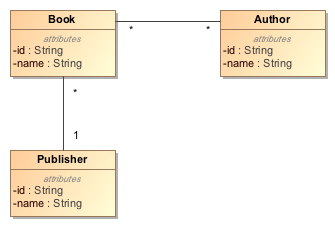
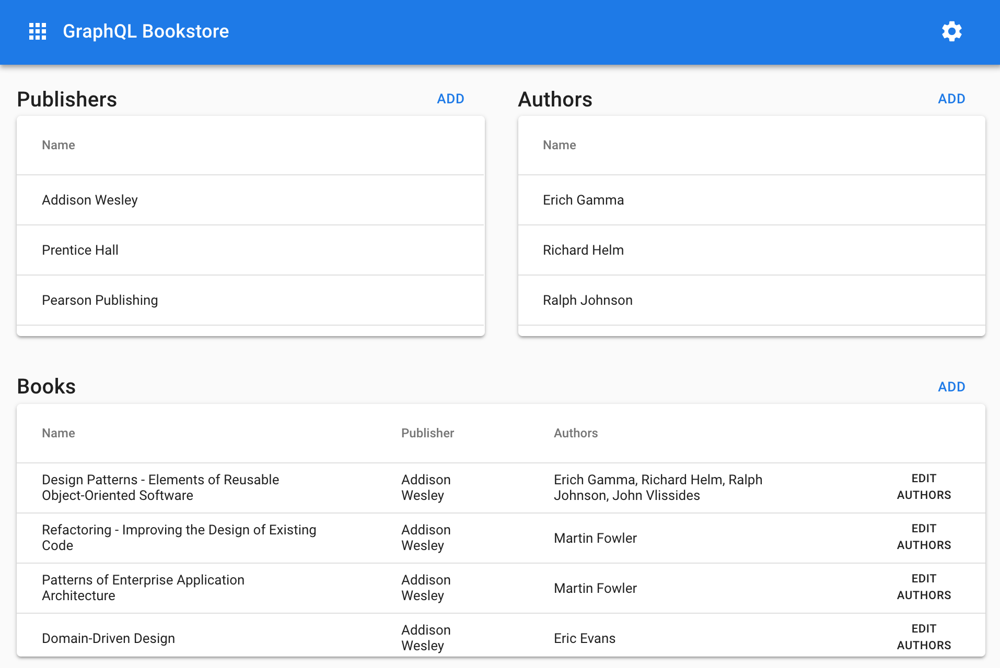

GraphQL Bookstore
=================
Most GraphQL tutorials use simplistic examples to demonstrate its capabilities. Unfortunately, when we start building real applications, we run into complexities that these tutorials do not address. This repo demonstrates the use of GraphQL to implement a rich domain with multiple entities and relationships. We use the [Apollo GraphQL](https://www.apollographql.com/) tools and libraries for this implementation.

1. Our example uses a simple book domain containing 3 entities and 2 relationships.
2. We demonstrate real-time updates on the client using GraphQL subscriptions.

Here's the domain model of our book domain:

- Every book has a publisher, a publisher may publish multiple books (one-to-many relationship).
- A book may have one or more authors, an author may write multiple books (many-to-many relationship).

Here's the front-end of the application. It is intentionally designed to show all the entities and relationships on one page. This allows us to demonstrate several features of the Apollo Cache, for example, how normalization keeps application data consistent across multiple components.

We have one server implementation that uses Apollo:
1. [Apollo Bookstore Server](./apollo-bookstore-server)

We have two client implementations using React Apollo:
1. [Apollo Bookstore Client](./apollo-bookstore-client)
2. [Apollo Bookstore Client with React Hooks](./apollo-bookstore-client-with-hooks)
